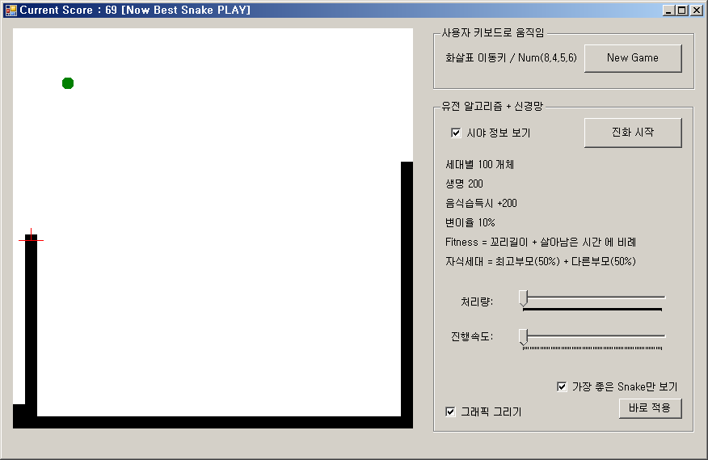

# SimpleNeuralNetwork

Simple Rocket(Genetic Algorithm)

XOR Train (Simple Neural Train)

Guess Number (Simple Neural Train by MNST Dataset)

Snake Game (Genetic + Neural Network)

간단한 신경망 네트워크 알고리즘입니다.
(구현에 목적을 두어서 소스코드 리페키징이 안되어 있습니다.)

+ NerualNetworkLibrary : 신경망네트워크와 행렬 라이브러리
+ SimpleNeuralNetwork : (1) Xor연산을 지도학습으로 예측 (2) MNIST로 학습하여 사용자가 그린 숫자 예측
+ SimpleRocket : 유전알고리즘을 이용한 목표물에 이동하는 원형 로켓
+ Snake : 스네이크 게임 (유전+신경망알고리즘)

Snake Game : https://en.wikipedia.org/wiki/Snake_(video_game_genre)

Neural Network : https://github.com/CodingTrain/Toy-Neural-Network-JS/blob/master/lib/nn.js

Matrix : https://github.com/CodingTrain/Toy-Neural-Network-JS/blob/master/lib/matrix.js

MNIST Source : http://yann.lecun.com/exdb/mnist/

MNIST Reader : https://stackoverflow.com/questions/49407772/reading-mnist-database

2020 Coded by GwangSu Lee
